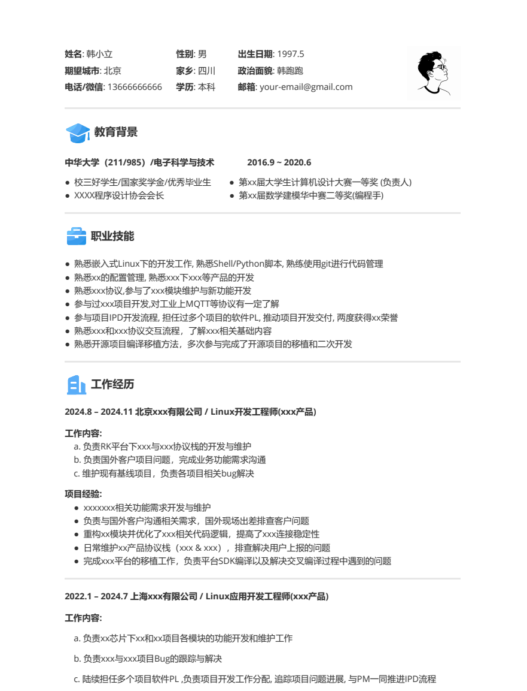
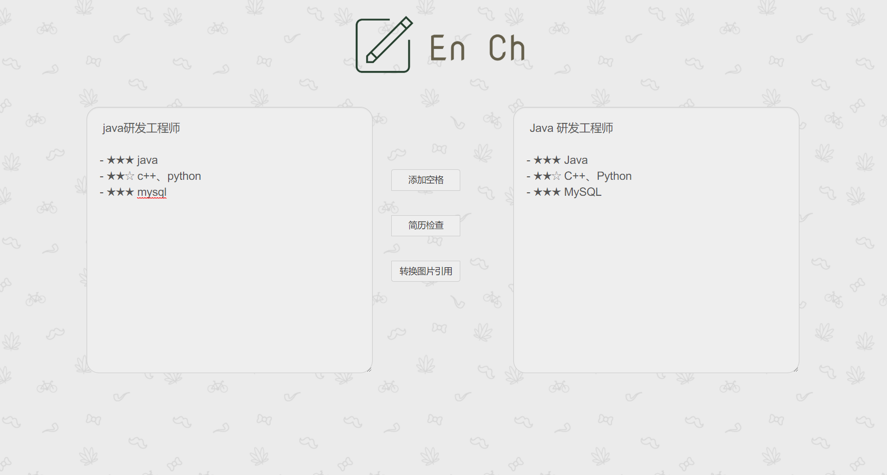

##  项目简介
本项目参考了：[Markdown-Resume](https://github.com/CyC2018/Markdown-Resume)

适用于有工作经验的同学参考使用，校招简历请自行修改对应内容

图标源自：[阿里巴巴矢量图标库](https://www.iconfont.cn/)

头像源自：[Pxiabay](https://pixabay.com/zh/)

如果觉得有用请帮忙点个star⭐️

## 简历预览



## 如何使用

把该项目 Clone 到本地之后，修改 [Resume.md](Resume.md) 文件后导出pdf文件即可。
可自行添加博客，github主页等信息到头部，带图标添加方式例如：

```html
<span>
    
    <a href="#">My Blog</a>
</span>
```
也可添加技术栈等信息到简历中，可自行添加。

字体建议使用微软雅黑Light，[Typora 0.9.96](https://github.com/iuxt/src/releases/download/2.0/typora-setup-x64_0.9.96.exe)版本可以到(文件->偏好设置->通用->高级设置)`C:\Users\username\AppData\Roaming\Typora\conf`下的json文件中修改。如果没有该字体可以先到word中下载或者直接在网上下载安装或者选择其他字体

```json
{
  "defaultFontFamily": {
    "standard": "Microsoft YaHei Light",
    "serif": "Microsoft YaHei Light", 
    "sansSerif": "Microsoft YaHei Light",
    "monospace": null 
  },
```
## 导出 PDF

可以直接使用typora导出pdf文件(文件->导出-PDF)

也可参考[Markdown-Resume](https://github.com/CyC2018/Markdown-Resume)使用 Typora 编辑器，先导出成 HTML，之后再使用浏览器打印成 PDF。


## 简历格式检查（根据需要）

https://cyc2018.github.io/Text-Typesetting/

- 在中文和英文数字之间加上空格可以大大提高文档的可读性
- 修改简历中技术名词的大小写
- 图片引用转换

## checklist
ref:[awesome-resume](https://github.com/resumejob/awesome-resume)
 - 使用 https://www.promptio.net/Resume 来优化简历描述
 - 按照时间倒序列出工作经历以及项目经验
 - 检查电话与邮箱地址是否正确，领英与简历同步更新
 - 使用前后一致的字体，行距与文字间距
 - 使用 Grammarly 或其他语法检查工具检查拼写
 - 使用 PDF 格式并且保持一页篇幅，简历命名方式为 “姓名_岗位.pdf”
